# Module/Directory: /Cookbook

**Last Updated:** 2025-04-20

> **Parent:** [`Server`](../README.md)

## 1. Purpose & Responsibility

* **What it is:** This directory serves as the primary domain module for the "Cookbook Factory" feature of the Zarichney API. It encapsulates all logic related to customer interactions, order processing, recipe management (acquisition, synthesis, storage), and AI interactions specific to cookbook creation.
* **Key Responsibilities:**
    * Orchestrating the end-to-end cookbook generation process, from order submission to PDF compilation and delivery.
    * Managing customer data and recipe credits.
    * Handling the lifecycle of cookbook orders.
    * Managing recipe data, including scraping, cleaning, indexing, searching, ranking, and AI-driven synthesis.
    * Defining specific prompts for interactions with AI services related to cookbook tasks.
* **Why it exists:** To group all related functionalities for the cookbook feature into a cohesive and maintainable module, separating it from concerns like core authentication, generic AI services, or payment processing.
* **Submodules:**
    * [`Customers`](./Customers/README.md) - Manages customer data, including available recipe credits.
    * [`Orders`](./Orders/README.md) - Handles cookbook order submission, processing logic, status tracking, and PDF generation coordination.
    * [`Prompts`](./Prompts/README.md) - Defines specific `PromptBase` implementations for AI tasks related to recipes and orders (e.g., cleaning, ranking, synthesizing, analyzing).
    * [`Recipes`](./Recipes/README.md) - Contains logic for acquiring (scraping), storing (file repository), indexing, searching, and synthesizing recipes.

## 2. Architecture & Key Concepts

* **Modular Design:** Functionality is broken down into specific subdirectories (`Customers`, `Orders`, `Prompts`, `Recipes`) each handling a distinct part of the cookbook domain.
* **Orchestration:** The `OrderService` typically acts as the central orchestrator, coordinating interactions between `CustomerService`, `RecipeService`, `PdfCompiler`, and `EmailService` to fulfill a cookbook order.
* **Recipe Lifecycle:** Managed primarily within the `Recipes` submodule, involving `WebScraperService` for acquisition, `RecipeRepository` for storage/indexing/cleaning/naming, `RecipeSearcher` for retrieval, and `RecipeService` for overall orchestration and synthesis.
* **AI Integration:** Heavily relies on AI for various tasks, with specific prompt logic defined in `Prompts` and interactions handled via the central `LlmService`.
* **Data Persistence:** Uses a file-based approach via `IFileService` for storing customer, order, and recipe data within the respective submodules.
* **Module Interactions Diagram:**

```mermaid
%% High-level architecture of the Cookbook module
graph TD
    subgraph CookbookModule ["Cookbook Module"]
        direction TB

        subgraph OrdersSubmodule ["Orders"]
            OrdersReadme["Orders/README.md"]
            OrderService["OrderService"]
        end

        subgraph RecipesSubmodule ["Recipes"]
            RecipesReadme["Recipes/README.md"]
            RecipeService["RecipeService"]
            RecipeRepo["RecipeRepository"]
            WebScraper["WebScraperService"]
        end

        subgraph CustomersSubmodule ["Customers"]
            CustomersReadme["Customers/README.md"]
            CustomerService["CustomerService"]
        end

        subgraph PromptsSubmodule ["Prompts"]
            PromptsReadme["Prompts/README.md"]
            PromptClasses["Prompt Classes"]
        end

        CookbookReadme["Cookbook/README.md"] -.-> OrdersReadme & RecipesReadme & CustomersReadme & PromptsReadme

        %% Core Interactions
        OrderService --> RecipeService
        OrderService --> CustomerService
        OrderService --> PdfCompilerSvc["PdfCompiler (Service)"]
        OrderService --> EmailSvc["EmailService (Service)"]
        OrderService --> BackgroundWorkerSvc["BackgroundWorker (Service)"]
        OrderService --> OrderRepo["OrderRepository"]

        RecipeService --> RecipeRepo
        RecipeService --> WebScraper
        RecipeService --> LlmSvc["LlmService (Service)"]
        RecipeService --> PromptClasses

        WebScraper --> BrowserSvc["BrowserService (Service)"]
        WebScraper --> LlmSvc

        RecipeRepo --> FileSvc["FileService (Service)"]
        RecipeRepo --> BackgroundWorkerSvc
        RecipeRepo --> LlmSvc 
        RecipeRepo --> PromptClasses

        CustomerService --> CustomerRepo["CustomerRepository"]
        CustomerRepo --> FileSvc

        OrderRepo --> FileSvc

        PromptsSubmodule -. Used By .-> LlmSvc
    end

    subgraph ExternalServices ["External Services / Core Utilities"]
        LlmSvc
        EmailSvc
        FileSvc
        PdfCompilerSvc
        BackgroundWorkerSvc
        BrowserSvc
    end

    subgraph Controllers ["API Controllers"]
        CookbookCtrl["CookbookController"]
        PaymentCtrl["PaymentController"]
    end

    %% External Interactions
    CookbookCtrl --> OrderService
    CookbookCtrl --> RecipeService
    PaymentCtrl --> OrderService
    PaymentCtrl --> CustomerService


    %% Styling
    classDef module fill:#cceeff,stroke:#007acc,stroke-width:1px;
    classDef service fill:#ccf,stroke:#333,stroke-width:2px;
    classDef file fill:#fff,stroke:#333,stroke-width:1px;
    classDef external fill:#e6ffe6,stroke:#006400,stroke-width:1px;
    classDef controller fill:#f9f,stroke:#333,stroke-width:2px;
    classDef prompt fill:#fff0b3,stroke:#cca300,stroke-width:1px;

    class CookbookReadme,OrdersReadme,RecipesReadme,CustomersReadme,PromptsReadme file;
    class OrderService,RecipeService,CustomerService,RecipeRepo,OrderRepo,CustomerRepo,WebScraper service;
    class LlmSvc,EmailSvc,FileSvc,PdfCompilerSvc,BackgroundWorkerSvc,BrowserSvc external;
    class CookbookCtrl,PaymentCtrl controller;
    class PromptClasses prompt;

```

* **Key Data Structures:** Defines core domain models within subdirectories (e.g., `Customer`, `CookbookOrder`, `Recipe`, `SynthesizedRecipe`).

## 3. Interface Contract & Assumptions

* **Key Public Interfaces (for external callers):** Primarily the service interfaces exposed by the submodules and consumed by controllers or other services:
    * `IOrderService`: Interface for submitting, retrieving, and managing cookbook orders.
    * `IRecipeService`: Interface for searching, retrieving, and synthesizing recipes.
    * `ICustomerService`: Interface for managing customer data and credits.
* **Assumptions:**
    * **Configuration:** Assumes relevant configuration sections (`OrderConfig`, `CustomerConfig`, `RecipeConfig`, `WebscraperConfig`, `LlmConfig`, `PdfCompilerConfig`) are correctly bound and available via DI.
    * **Service Availability:** Assumes dependent services ([`/Services/AI`](../../Services/AI/README.md), [`/Services/Email`](../../Services/Email/README.md), [`/Services/Payment`](../../Services/Payment/README.md), [`/Services`](../../Services/README.md) like `IFileService`, `IBackgroundWorker`, `IBrowserService`) are registered and functional.
    * **Data Storage:** Assumes the file system paths configured for data output (`Data/Customers`, `Data/Orders`, `Data/Recipes`) are writable by the application user (`ec2-user` in production).
    * **AI Model Access:** Assumes valid credentials/API keys for AI services (e.g., OpenAI) are configured.

## 4. Local Conventions & Constraints (Beyond Global Standards)

* **Subdirectory Structure:** Organizes code strictly by domain concern (Customers, Orders, Prompts, Recipes).
* **AI Prompts:** All prompts specific to cookbook generation logic reside in the `Prompts` subdirectory, inheriting from `PromptBase`.
* **Data Storage:** Adheres to a file-based persistence strategy using `IFileService`. Filenames often derived from IDs or email addresses (sanitized).
* **Training Data:** Example data for specific AI prompt fine-tuning (like `RecipeNamer`) is stored in the `Training` subdirectory within `Recipes`.

## 5. How to Work With This Code

* **Understanding Flow:** Start by examining `CookbookController` to see how requests enter the module, then follow the calls into `OrderService`, `RecipeService`, and `CustomerService` to understand the orchestration.
* **Adding Features:** New cookbook-related functionality should likely reside within one of the existing submodules or potentially a new submodule if it represents a distinct concern.
* **AI Modifications:** Changes to AI behavior typically involve modifying the relevant `PromptBase` implementation in the `Prompts` directory and potentially the corresponding service logic that uses it.
* **Testing:** Requires mocking dependencies between the submodules and core services (e.g., mocking `IRecipeService` when testing `OrderService`, mocking `ILlmService` when testing `RecipeService`). Integration tests are important to verify the end-to-end flow.

## 6. Dependencies

* **Internal Code Dependencies:**
    * [`/Services`](../../Services/README.md): Relies heavily on `IFileService`, `ILlmService`, `IEmailService`, `PdfCompiler`, `IBackgroundWorker`, `IBrowserService`, `ISessionManager`.
    * [`/Config`](../../Config/README.md): Consumes various `*Config` objects.
* **External Library Dependencies:**
    * `AutoMapper`: Used for mapping between different recipe model types.
    * `MediatR`: May be used implicitly if commands/queries are defined within submodules (though primarily seen in Auth).
    * `OpenAI`: Core dependency for AI interactions via `LlmService`.
    * `Polly`: Used for retries, especially within `OrderService` for email.
    * `QuestPDF`: Used by `PdfCompiler` for PDF generation.
    * `AngleSharp`, `Playwright`: Used by `WebScraperService` (within Recipes).
* **Dependents (Impact of Changes):**
    * [`/Controllers/CookbookController.cs`](../../Controllers/CookbookController.cs): Primary consumer of the services defined within this module (`IOrderService`, `IRecipeService`).
    * [`/Controllers/PaymentController.cs`](../../Controllers/PaymentController.cs): Consumes `IOrderService`, `ICustomerService`.

## 7. Rationale & Key Historical Context

* **Modular Design:** The separation into `Customers`, `Orders`, `Recipes`, and `Prompts` was chosen to manage the complexity of the cookbook generation feature and improve maintainability.
* **AI-Centric Approach:** Core functionalities like recipe cleaning, ranking, naming, synthesis, and analysis are delegated to AI, making it central to the module's operation.
* **File-Based Persistence:** Selected for simplicity within the scope of this project, offering ease of inspection and modification during development, while acknowledging potential scalability limitations compared to a database.

## 8. Known Issues & TODOs

* File-based storage for recipes, orders, and customers may encounter performance bottlenecks or concurrency issues at very high scale. Consider migrating to a database solution if needed.
* Web scraping logic in the `Recipes` submodule is inherently brittle and dependent on external website structures remaining consistent.
* Error handling for AI service failures could be further refined (e.g., more specific fallback strategies).
* Lack of comprehensive unit and integration tests covering the interactions between the various services within this module.