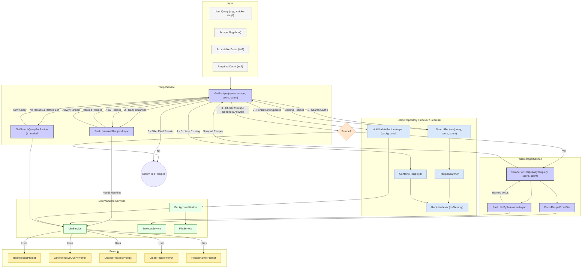

# Module/Directory: /Cookbook/Recipes

**Last Updated:** 2025-04-20

> **Parent:** [`/Cookbook`](../README.md)

## 1. Purpose & Responsibility

* **What it is:** This module encompasses all functionalities related to the acquisition, processing, storage, retrieval, and synthesis of recipes for the Cookbook Factory. It's the core engine for recipe data management and generation.
* **Key Responsibilities:**
    * Acquiring recipe data from external websites via web scraping (`WebScraperService`).
    * Cleaning, standardizing, and enhancing scraped recipe data using AI (`RecipeRepository`, `CleanRecipePrompt`).
    * Generating concise index titles and searchable aliases for recipes using AI (`RecipeRepository`, `RecipeNamerPrompt`).
    * Ranking the relevance of scraped or existing recipes against specific queries using AI (`RecipeService`, `RankRecipePrompt`).
    * Persisting recipe data (currently to the file system via `RecipeRepository` and `IFileService`).
    * Maintaining an in-memory index (`RecipeIndexer`) for fast recipe lookup by title/alias.
    * Providing search functionality (`RecipeSearcher`) to find relevant recipes based on queries and scores.
    * Orchestrating the synthesis of new, personalized recipes based on source recipes and order specifications (`RecipeService`, `SynthesizeRecipePrompt`).
    * Analyzing the quality and suitability of synthesized recipes using AI (`RecipeService`, `AnalyzeRecipePrompt`).
    * Defining recipe data structures (`Recipe`, `ScrapedRecipe`, `CleanedRecipe`, `SynthesizedRecipe`, etc.).
* **Why it exists:** To consolidate all complex logic related to recipe data handling, from external acquisition to AI-driven generation and quality control, providing a clear service interface (`IRecipeService`) to other parts of the application (primarily `OrderService`).
* **Subdirectories:**
    * `Training/`: Contains example data files (e.g., `RecipeNamer.json`) and potentially prompt definition classes (e.g., `TrainingPrompt.cs`) used for few-shot learning or specific training-related tasks for AI prompts within this module.

## 2. Architecture & Key Concepts

* **Orchestration:** `RecipeService` acts as the primary entry point and orchestrator for recipe retrieval (`GetRecipes`) and synthesis (`SynthesizeRecipe`).
* **Repository Pattern:** `RecipeRepository` (`RecipeFileRepository` implementation) abstracts data persistence (file system via `IFileService`) and manages the asynchronous background processing (via `IBackgroundWorker`) of cleaning and naming tasks. It interacts with `RecipeIndexer` and `RecipeSearcher`.
* **Alternative Query Generation:** `RecipeService.GetSearchQueryForRecipe` uses structured function calling with `GetAlternativeQueryPrompt` to generate more generic search terms when specific recipe names fail to yield results. It leverages conversation history through a provided `conversationId` and returns a structured `AlternativeQueryResult` containing the new query. This eliminates the need for manual conversation state management by utilizing the session-based context tracking in `ILlmService`.
* **Web Scraping:** `WebScraperService` handles finding and extracting recipe data from external websites using Playwright (`IBrowserService`) and CSS selectors defined in `site_selectors.json`. It uses `LlmService` (`ChooseRecipesPrompt`) to rank URL relevance.
* **Indexing & Search:** `RecipeIndexer` maintains an efficient in-memory `ConcurrentDictionary` mapping titles/aliases to recipes. `RecipeSearcher` implements the logic to query this index and apply scoring.
* **AI Integration:** Extensive use of `ILlmService` with specific prompts from [`/Cookbook/Prompts`](../Prompts/README.md) for data cleaning, relevance ranking, alias generation, recipe synthesis, and quality analysis.
* **Data Models:** Defines various representations of recipe data (`Recipe`, `ScrapedRecipe`, `CleanedRecipe`, `SynthesizedRecipe`, `RelevancyResult`, `RecipeAnalysis`) in `RecipeModels.cs`.
* **Mapping:** `AutoMapper` is used (configured in `RecipeModels.cs`) to map between different recipe data representations (e.g., `ScrapedRecipe` to `Recipe`).
* **Concurrency:** Uses `Parallel.ForEachAsync` (via `ISessionManager`), `SemaphoreSlim`, and `ConcurrentDictionary` to handle parallel processing of scraping, ranking, cleaning, and indexing tasks. Parallelism levels are configured via `RecipeConfig` and `WebscraperConfig`.
* **GetRecipes Workflow Diagram:**

## 3. Interface Contract & Assumptions

* **Key Public Interfaces:**
    * `IRecipeService`: Primary interface for external consumers (`OrderService`). Methods include `GetRecipes` (retrieval/scraping with optional `conversationId` for AI conversation history) and `SynthesizeRecipe`. [cite: api-server/Cookbook/Recipes/RecipeService.cs]
    * `IRecipeRepository`: Interface for managing recipe persistence and triggering background processing. Includes `InitializeAsync`, `SearchRecipes`, `AddUpdateRecipesAsync`. [cite: api-server/Cookbook/Recipes/RecipeRepository.cs]
    * `IRecipeIndexer`, `IRecipeSearcher`: Interfaces for indexing and searching operations. [cite: api-server/Cookbook/Recipes/RecipeIndexer.cs, api-server/Cookbook/Recipes/RecipeSearcher.cs]
* **Assumptions:**
    * **External Services:** Assumes availability and correct configuration of `ILlmService` (with API keys), `IBrowserService` (with Playwright installed), `IFileService`, `IBackgroundWorker`, and `ISessionManager`. Requires network connectivity for scraping and AI calls. [cite: api-server/Program.cs]
    * **Configuration:** Assumes `RecipeConfig`, `WebscraperConfig`, `LlmConfig` are correctly configured. Assumes `site_selectors.json` exists and contains accurate, up-to-date CSS selectors for target websites. [cite: api-server/appsettings.json, api-server/Config/site_selectors.json]
    * **AI Reliability:** Assumes AI models respond consistently and adhere to the function schemas defined in the prompts. Assumes AI-generated rankings, cleanups, and syntheses meet quality expectations (though analysis steps mitigate this).
    * **Scraping Stability:** Assumes target websites maintain their structure; changes will break scraping for those sites. [cite: api-server/Cookbook/Recipes/WebScraperService.cs]
    * **Data Consistency:** Assumes `FileService` handles concurrent writes appropriately. Assumes `RecipeIndexer`'s in-memory state is consistent with persisted data (potential for drift if initialization or updates fail).

## 4. Local Conventions & Constraints (Beyond Global Standards)

* **AI-Driven Logic:** Core functionalities heavily rely on specific prompts defined in [`/Cookbook/Prompts`](../Prompts/README.md) and interactions with `ILlmService`.
* **Persistence:** File-based storage managed by `RecipeRepository` under the path configured in `RecipeConfig.OutputDirectory` (default `Data/Recipes`). Recipes might be grouped into files based on their `IndexTitle`. [cite: api-server/Cookbook/Recipes/RecipeRepository.cs]
* **Scraping Configuration:** Scraping behavior and target sites are dictated by `site_selectors.json`. [cite: api-server/Config/site_selectors.json]
* **Performance:** Relies on parallel processing (configured via `RecipeConfig`, `WebscraperConfig`) for scraping, ranking, and cleaning to manage latency. Search performance depends on the efficiency of `RecipeIndexer` and `RecipeSearcher`. AI call latency and cost are significant factors.
* **Technology:** Uses Playwright via `BrowserService` for web scraping. Uses `AutoMapper` for object mapping.

## 5. How to Work With This Code

* **Setup:** Ensure OpenAI API Key (`LlmConfig:ApiKey`) is configured. Ensure Playwright dependencies are installed (`Scripts/install-playwright.ps1` or similar). Maintain `site_selectors.json`.
* **Adding Scraper Sites:** Update `site_selectors.json` with the new site key, base URL, and CSS selectors. Test thoroughly using `Scripts/test_sites.sh`. [cite: api-server/Config/site_selectors.json, api-server/Scripts/test_sites.sh]
* **Modifying AI Behavior:** Adjust the relevant prompt class in [`/Cookbook/Prompts`](../Prompts/README.md) (e.g., change `SystemPrompt`, `GetFunction` schema).
* **Testing:** Essential to mock dependencies: `ILlmService`, `IBrowserService`, `IFileService`, `IBackgroundWorker`, `ISessionManager`. Unit test individual service logic (ranking, cleaning, searching). Integration tests needed to verify the flow between `RecipeService`, `RecipeRepository`, `WebScraperService`, and `LlmService`. Test scraping edge cases (site changes, no results, network errors).
* **Common Pitfalls / Gotchas:** Scraping fragility (selectors breaking). AI model inconsistencies or changes requiring prompt updates. Configuration errors (API keys, `site_selectors.json`). Potential race conditions if file locking/indexing concurrency isn't perfectly handled (though efforts made via `FileService` and `ConcurrentDictionary`). Performance bottlenecks due to external dependencies (AI, websites). Cost implications of frequent AI calls and scraping.

## 6. Dependencies

* **Internal Code Dependencies:**
    * [`/Services/AI`](../../Services/AI/README.md): Consumes `ILlmService`.
    * [`/Services`](../../Services/README.md): Consumes `IFileService`, `IBrowserService`, `IBackgroundWorker`, `Utils`.
    * [`/Config`](../../Config/README.md): Consumes `RecipeConfig`, `WebscraperConfig`, `LlmConfig`. Uses `PromptBase`. Consumes `site_selectors.json`.
    * [`/Cookbook/Prompts`](../Prompts/README.md): Consumes various prompt implementations (`CleanRecipePrompt`, `RankRecipePrompt`, etc.).
    * [`/Services/Sessions`](../../Services/Sessions/README.md): Consumes `ISessionManager`, `IScopeContainer`.
* **External Library Dependencies:**
    * `OpenAI`: For AI interactions.
    * `PlaywrightSharp` / `Microsoft.Playwright`: For web scraping via `BrowserService`.
    * `AngleSharp`: For HTML parsing during scraping.
    * `AutoMapper`: For object mapping.
    * `Polly`: Used for retries in underlying services (`LlmService`, `FileService`).
* **Dependents (Impact of Changes):**
    * [`/Cookbook/Orders/OrderService.cs`](../Orders/OrderService.cs): Primary consumer of `IRecipeService`.
    * [`/Controllers/CookbookController.cs`](../../Controllers/CookbookController.cs): Exposes recipe search/scrape functionality via `IRecipeService`.
    * `Program.cs`: Registers services and configuration for this module.

## 7. Rationale & Key Historical Context

* **AI-Driven Processing:** Adopted to handle the complexity and subjectivity of tasks like cleaning unstructured scraped data, assessing relevance, generating creative variations (synthesis), and performing quality analysis.
* **Abstraction Layers:** `IRecipeService` provides a high-level interface, while `IRecipeRepository` abstracts the chosen persistence mechanism (currently files). `RecipeIndexer` and `RecipeSearcher` separate indexing logic from core repository tasks.
* **Web Scraping Necessity:** Required to obtain a diverse corpus of source recipes for the AI to synthesize from, as a pre-existing, structured database was not available/used. The brittleness of scraping is acknowledged.
* **Asynchronous Processing:** Background tasks (`IBackgroundWorker`) are used for potentially time-consuming AI operations (cleaning, naming) initiated by `RecipeRepository` to avoid blocking repository operations like `AddUpdateRecipesAsync`.

## 8. Known Issues & TODOs

* **Scraping Fragility:** `site_selectors.json` requires constant monitoring and updating as target websites change. The `test_sites.sh` script helps, but manual verification is often needed. [cite: api-server/Scripts/test_sites.sh]
* **Scalability of Storage:** The file-based `RecipeRepository` loads all known recipes during `InitializeAsync`, which will not scale well to hundreds of thousands or millions of recipes. Migration to a database (e.g., PostgreSQL with full-text search or a vector database) would be necessary for larger scale. [cite: api-server/Cookbook/Recipes/RecipeRepository.cs]
* **Testing Coverage:** The provided codebase lacks explicit unit or integration tests for this module, which is critical given its complexity and reliance on external services.
* **Caching:** Opportunities exist to cache results from web scraping or certain AI calls (e.g., cleaning, ranking for the same recipe/query pair) to reduce latency and cost.
* **Error Handling Nuances:** Handling of AI content filter exceptions (`OpenAiContentFilterException`) could be more sophisticated. Error recovery within parallel loops could be improved. [cite: api-server/Cookbook/Recipes/RecipeRepository.cs]