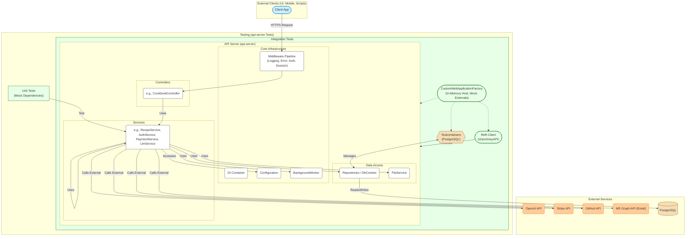

# Module/Directory: api-server

**Last Updated:** 2025-01-25

> **Parent:** [`/`](../README.md)

## 1. Purpose & Responsibility

* **What it is:** The main ASP.NET 8 Web API application for the Zarichney platform. It serves as the backend for various features, including the AI-powered Cookbook Factory, authentication, payment processing, and potentially future micro-applications.
* **Key Responsibilities:**
    * Exposing RESTful API endpoints via controllers.
    * Implementing business logic within domain-specific services (e.g., Cookbook, Auth, Payment).
    * Interacting with external services (OpenAI, Stripe, GitHub, MS Graph).
    * Managing application configuration and state.
    * Providing core infrastructure services (File System, Background Tasks, Email, PDF Generation).
* **Key Subdirectories/Components:**
    * [`/Config`](./Config/README.md): Core configuration, constants, middleware, extensions.
    * [`/Controllers`](./Controllers/README.md): API endpoint definitions.
    * [`/Cookbook`](./Cookbook/README.md): Domain logic for the AI Cookbook feature.
    * [`/Docs`](./Docs/README.md): Swagger/OpenAPI documentation setup.
    * `/Properties`: Build and launch settings.
    * [`/Services`](./Services/README.md): Core infrastructure and cross-cutting services (Auth, AI, Email, Payment, etc.).
    * [`/Startup`](./Startup/README.md): Application startup configuration logic (DI registration, middleware pipelines).
    * **Related Project:** [`../api-server.Tests`](../api-server.Tests/README.md): Contains all unit and integration tests for this API server.

## 2. Architecture & Key Concepts

* **Technology:** .NET 8, ASP.NET Core Web API, C#.
* **Architecture Style:** Primarily a modular monolith with clear separation of concerns between controllers, services, and potentially repositories (where applicable, e.g., Auth `UserDbContext`, file-based repositories in `Cookbook`). Utilizes Dependency Injection heavily.
* **Key Patterns:**
    * **Dependency Injection:** Services are registered in `/Startup/` or extension methods and injected via constructors.
    * **Middleware:** Used for cross-cutting concerns like logging (`LoggingMiddleware`), error handling (`ErrorHandlingMiddleware`), authentication (`AuthenticationMiddleware`), and session management (`SessionMiddleware`).
    * **Configuration:** Strongly-typed configuration classes (`XConfig`) loaded from `appsettings.json` and environment variables/secrets, registered via `ConfigurationExtensions`.
    * **Background Tasks:** Utilizes `BackgroundWorker` (based on `Channel<T>`) for queuing and processing long-running tasks asynchronously.
    * **External API Integration:** Uses libraries like `RestSharp`, `OpenAI-DotNet`, `Stripe.net`, `Octokit`, `Microsoft.Graph` for interacting with external services, often wrapped in dedicated internal services (e.g., `LlmService`, `StripeService`, `GitHubService`, `EmailService`). Polly is used for retry policies.
    * **Authentication:** Uses JWT Bearer tokens and Refresh Tokens managed via cookies (`CookieAuthManager`, `AuthService`). ASP.NET Core Identity is used for user/role management backed by `UserDbContext` (PostgreSQL). API Key authentication is also supported via `AuthenticationMiddleware`.
    * **Logging:** Enhanced configurable logging system using Serilog with default Warning level, environment-specific configuration overrides, and support for namespace-specific log levels. Full configuration guide available at [`../Docs/Development/LoggingGuide.md`](../Docs/Development/LoggingGuide.md).
    * **Testing:** A dedicated companion project (`../api-server.Tests`) contains comprehensive unit and integration tests. Integration tests leverage `CustomWebApplicationFactory` for in-memory hosting, Testcontainers for isolated PostgreSQL databases (`DatabaseFixture`), and a Refit-generated HTTP client (`IZarichneyAPI`) for API interaction. External dependencies are mocked during testing.
* **Architectural Diagram:**
    *(Diagram follows conventions defined in [`/Docs/Standards/DiagrammingStandards.md`](../Docs/Standards/DiagrammingStandards.md))*


## 3. Interface Contract & Assumptions

* **API Contract:** Defined by the OpenAPI specification available at `/swagger`. Controllers define the request/response DTOs (often using Records).
* **Authentication:** Most endpoints require authentication via JWT Bearer token (obtained via `/api/auth/login`) or API Key. Specific authorization requirements (roles) are documented per endpoint via `[Authorize]` attributes.
* **Configuration Dependency:** Assumes necessary configuration (API keys, connection strings, settings) is provided via `appsettings.json`, environment variables, or secrets manager as defined in `/Config/README.md`. Missing critical config may lead to runtime errors (`ConfigurationMissingException`).
* **External Services:** Assumes availability and correct configuration of external dependencies (OpenAI, Stripe, etc.). Uses Polly for transient error handling but may fail if external services are down or misconfigured.

## 4. Local Conventions & Constraints

* **Primary Language:** C\# 12 with .NET 8.
* **Coding Standards:** Strictly adhere to [`/Docs/Standards/CodingStandards.md`](https://www.google.com/search?q=../Docs/Standards/CodingStandards.md) and rules enforced by `.editorconfig`.
* **Documentation Standards:** All subdirectories with significant logic **MUST** have a `README.md` following [`/Docs/Standards/DocumentationStandards.md`](https://www.google.com/search?q=../Docs/Standards/DocumentationStandards.md) and the template in [`/Docs/Templates/ReadmeTemplate.md`](https://www.google.com/search?q=../Docs/Templates/ReadmeTemplate.md).
* **Testing Standards:** All new features/fixes **MUST** include corresponding tests adhering to [`/Docs/Standards/TestingStandards.md`](https://www.google.com/search?q=../Docs/Standards/TestingStandards.md).

## 5. How to Work With This Code

* **Setup:**
1.  Ensure .NET 8 SDK is installed.
2.  Configure necessary secrets (API Keys, DB connection string) using User Secrets (`dotnet user-secrets set ...`) or environment variables, referencing `appsettings.json` and module READMEs for required keys.
3.  Ensure Docker Desktop is running (for integration tests using Testcontainers).
4.  Build the solution: `dotnet build Zarichney.sln` (from root directory).
5.  Apply database migrations (if using UserDbContext): Navigate to `/api-server/` and run `dotnet ef database update --context UserDbContext`.
* **Running Locally:**
* From the `/api-server/` directory, run `dotnet run`.
* Access the API via `https://localhost:7061` (or configured port).
* Swagger UI is available at `https://localhost:7061/swagger`.
* **Running Tests:** **(New)**
* Navigate to the repository root directory (`zarichney-api/`).
* Run all tests: `dotnet test Zarichney.sln`
* Run only Unit tests: `dotnet test --filter "Category=Unit"`
* Run only Integration tests: `dotnet test --filter "Category=Integration"` (Requires Docker)
* Run tests for a specific feature (using Traits): `dotnet test --filter "Category=Integration&Feature=Auth"`
* **Regenerating API Client for Tests:** **(New)**
* If API contracts in `/api-server/Controllers/` change, the Refit client used by integration tests (`/api-server.Tests/Framework/Client/IZarichneyAPI.cs`) needs regeneration.
* From the repository root directory (`zarichney-api/`), run the script:
```powershell
./Scripts/GenerateApiClient.ps1
```
* **Key Tooling:**
* `.NET CLI`
* `Entity Framework Core Tools` (`dotnet ef`)
* `Docker Desktop` (for integration testing)
* `GitHub CLI` (`gh`) (for AI Coder workflow)

## 6. Dependencies

* **Internal (Key Modules Consumed):** Services consume each other via DI (e.g., `CookbookController` uses `RecipeService`, `OrderService`; `AuthService` uses `EmailService`). See individual service/controller READMEs for specifics.
* **External Libraries:** .NET 8 SDK, ASP.NET Core, EF Core, Serilog, Polly, MediatR, AutoMapper, Swashbuckle, RestSharp, OpenAI-DotNet, Stripe.net, Octokit, Microsoft.Graph, PlaywrightSharp, AngleSharp, QuestPDF, Testcontainers, xUnit, Moq, FluentAssertions, Refit.
* **Infrastructure:** PostgreSQL Database, potentially AWS services for deployment (S3, ECS, etc.).

## 7. Rationale & Key Historical Context

* Developed as a modular backend to support various personal projects and experiments, starting with the AI Cookbook Factory.
* Architecture aims for reasonable separation of concerns while remaining manageable as a single deployable unit initially.
* Emphasis on robust testing (`api-server.Tests`) added early after encountering regressions.
* AI-assisted development workflow adopted to accelerate development and explore new methodologies.

## 8. Known Issues & TODOs

* Scalability of file-based storage for Cookbook data needs review (see `ShortTermRoadmap.md`).
* Configuration handling could be improved (see `ShortTermRoadmap.md`).
* See individual module READMEs for specific TODOs or known issues.
* Refer to `/Docs/Development/ShortTermRoadmap.md` for broader planned work.

-----
