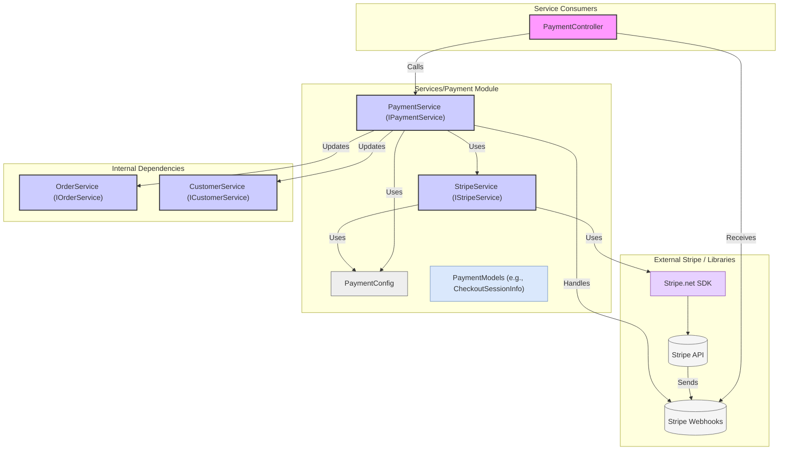

# Module/Directory: /Services/Payment

**Last Updated:** 2025-04-14

> **Parent:** [`/Services`](../README.md)

## 1. Purpose & Responsibility

* **What it is:** This module integrates with the external payment provider (currently Stripe) to handle payments for cookbook orders and recipe credits.
* **Key Responsibilities:**
    * Defining configuration (`PaymentConfig`) and data models (`CheckoutSessionInfo`, `StripeSessionMetadata`) related to payment processing. [cite: api-server/Services/Payment/PaymentModels.cs]
    * Providing a service (`IPaymentService`) to create payment checkout sessions for specific cookbook orders or for purchasing recipe credits. [cite: api-server/Services/Payment/PaymentService.cs]
    * Abstracting direct interactions with the Stripe API via `IStripeService`. [cite: api-server/Services/Payment/StripeService.cs]
    * Handling incoming webhook events from Stripe to process payment confirmations (e.g., `checkout.session.completed`) or failures. [cite: api-server/Services/Payment/PaymentService.cs]
    * Updating application state (e.g., customer credits via `ICustomerService`, order status via `IOrderService`) based on webhook event outcomes. [cite: api-server/Services/Payment/PaymentService.cs]
* **Why it exists:** To centralize payment-related logic, isolate interactions with the specific payment provider (Stripe), and decouple payment processing from core domain logic like order fulfillment or user management.

## 2. Architecture & Key Concepts

* **Provider Abstraction:** `IStripeService` acts as an abstraction layer over the `Stripe.net` library, encapsulating direct API calls for creating sessions, retrieving session data, and constructing webhook events. [cite: api-server/Services/Payment/StripeService.cs]
* **Business Logic Layer:** `PaymentService` implements `IPaymentService` and contains the higher-level logic. It determines payment amounts, constructs metadata (`StripeSessionMetadata`), calls `IStripeService` to create sessions, and interprets webhook events to trigger actions via `IOrderService` and `ICustomerService`. [cite: api-server/Services/Payment/PaymentService.cs]
* **Stripe Checkout:** Leverages Stripe Checkout, a prebuilt, hosted payment page, simplifying PCI compliance and UI development. `PaymentService`/`StripeService` create Checkout Sessions, and the client-side redirects the user to the URL provided by Stripe. [cite: api-server/Services/Payment/StripeService.cs]
* **Webhooks:** Relies on asynchronous webhook events sent from Stripe to the `/api/payment/webhook` endpoint to confirm payment status changes reliably. `PaymentService.HandleWebhookEvent` parses these events (using `IStripeService.ConstructEvent`) and triggers appropriate actions based on the event type (e.g., `checkout.session.completed`, `payment_intent.succeeded`). [cite: api-server/Services/Payment/PaymentService.cs, api-server/Controllers/PaymentController.cs]
* **Metadata:** Uses Stripe session metadata to pass application-specific context (like `PaymentType`, `CustomerEmail`, `RecipeCount`, `order_id` via `ClientReferenceId`) through the checkout process, which is retrieved later during webhook processing. [cite: api-server/Services/Payment/PaymentModels.cs, api-server/Services/Payment/PaymentService.cs]
* **Configuration:** Requires `PaymentConfig` (Stripe keys, webhook secret, product price, currency) and `ClientConfig` (for constructing success/cancel redirect URLs). [cite: api-server/Services/Payment/PaymentModels.cs, api-server/Config/ConfigModels.cs, api-server/appsettings.json]
* **Diagram:**

## 3. Interface Contract & Assumptions

* **Key Public Interfaces:** `IPaymentService` (for controllers), `IStripeService` (internal abstraction).
    * `IPaymentService.CreateCheckoutSession(order)` / `IPaymentService.GetCheckoutSessionWithUrl(order)`: Creates Stripe session for order payment. Assumes order exists and requires payment.
    * `IPaymentService.CreateCheckoutSession(customer, count)` / `IPaymentService.GetCreditCheckoutSessionWithUrl(customer, count)`: Creates Stripe session for credit purchase. Assumes customer exists.
    * `IPaymentService.HandleWebhookEvent(body, signature)`: Processes incoming webhook. Assumes valid Stripe signature and JSON body. Assumes webhook endpoint is correctly configured in Stripe.
    * `IPaymentService.GetSessionInfo(sessionId)`: Retrieves session details from Stripe.
* **Runtime Configuration Validation:**
    * The service will start even if `PaymentConfig` values (`StripeSecretKey`, `StripeWebhookSecret`) are missing, allowing the application to start with partial functionality.
    * Each method in `IStripeService` validates required configuration at runtime before making API calls:
        * Methods requiring API access (CreateCheckoutSession, GetSession, etc.) will throw `ConfigurationMissingException` if `StripeSecretKey` is missing.
        * `ConstructEvent` will throw `ConfigurationMissingException` if `StripeWebhookSecret` is missing.
    * These exceptions are thrown when the methods are called, rather than at startup, allowing the application to start even with missing configuration.
* **Assumptions:**
    * **Stripe Configuration:** Assumes valid Stripe API keys (`PaymentConfig.StripeSecretKey`, `PaymentConfig.StripePublishableKey`) and webhook secret (`PaymentConfig.StripeWebhookSecret`) are configured securely.
    * **Webhook Setup:** Assumes the `/api/payment/webhook` endpoint is publicly accessible and configured correctly in the Stripe dashboard to receive necessary events (e.g., `checkout.session.completed`, `payment_intent.succeeded`).
    * **Network Connectivity:** Requires reliable network access to `api.stripe.com`.
    * **Dependent Services:** Assumes `IOrderService` and `ICustomerService` are functional for updating state upon successful payment confirmation via webhook.
    * **Client Redirects:** Assumes the client-side application correctly uses the session URL returned by `GetCheckoutSessionWithUrl` / `GetCreditCheckoutSessionWithUrl` to redirect the user to Stripe Checkout.

## 4. Local Conventions & Constraints (Beyond Global Standards)

* **Payment Provider:** Tightly coupled to Stripe via `Stripe.net` library and `StripeService`. Switching providers would require a new service implementation and changes in `PaymentService`.
* **Configuration:** Requires `PaymentConfig` and `ClientConfig` sections in application configuration. Stripe keys and webhook secret are highly sensitive.
* **Webhook Signature Validation:** Relies on `EventUtility.ConstructEvent` from `Stripe.net` for secure webhook signature validation using the configured `StripeWebhookSecret`. [cite: api-server/Services/Payment/StripeService.cs]
* **Event Handling:** Uses specific Stripe event type strings (e.g., `checkout.session.completed`) for dispatching logic within `HandleWebhookEvent`. [cite: api-server/Services/Payment/PaymentService.cs]

## 5. How to Work With This Code

* **Configuration:** Securely configure Stripe API keys and the webhook signing secret (user secrets, environment variables, AWS Secrets Manager recommended). Configure the webhook endpoint in your Stripe dashboard.
* **Testing:**
    * Mock `IStripeService`, `IOrderService`, `ICustomerService` to unit test `PaymentService`.
    * Mock Stripe HTTP responses or use Stripe's test fixtures if testing `StripeService`.
    * Webhook testing requires tools like the Stripe CLI (`stripe listen --forward-to <your_local_webhook_url>`) or ngrok to receive events locally during development. Ensure the local environment uses the correct webhook secret for validation.
* **Common Pitfalls / Gotchas:** Incorrect API keys or webhook secret. Firewall blocking incoming webhooks. Errors in webhook handling logic leading to orders/credits not being updated correctly. Stripe API changes requiring SDK or logic updates. Forgetting to handle different payment statuses or event types appropriately.

## 6. Dependencies

* **Internal Code Dependencies:**
    * [`/Config`](../../Config/README.md): Consumes `PaymentConfig`, `ClientConfig`.
    * [`/Cookbook/Orders`](../../Cookbook/Orders/README.md): Consumes `IOrderService`.
    * [`/Cookbook/Customers`](../../Cookbook/Customers/README.md): Consumes `ICustomerService`.
* **External Library Dependencies:**
    * `Stripe.net`: Official .NET library for the Stripe API.
* **Dependents (Impact of Changes):**
    * [`/Controllers/PaymentController.cs`](../../Controllers/PaymentController.cs): Primary consumer of `IPaymentService`.
    * `Program.cs`: Registers payment services and configuration.

## 7. Rationale & Key Historical Context

* **Stripe Integration:** Stripe chosen as the payment provider. `StripeService` created to isolate direct SDK interactions.
* **Webhook Reliance:** Webhooks are used for reliable, asynchronous confirmation of payment success/failure, rather than relying solely on client-side redirects which can be unreliable.
* **Service Separation:** `PaymentService` handles the business logic (what happens before/after payment), while `StripeService` handles the "how" of talking to Stripe.

## 8. Known Issues & TODOs

* **Webhook Idempotency:** Current webhook handling relies on Stripe's retry mechanism and basic logging. Implementing more robust idempotency checks (e.g., storing processed event IDs) could prevent duplicate processing in edge cases.
* **Error Handling in Webhooks:** Failures during webhook processing (e.g., updating order fails) should ideally be handled gracefully, potentially requeuing the event or notifying administrators. Returning non-200 OK to Stripe will cause retries, which might be desirable but needs careful handling.
* **Provider Lock-in:** Design is heavily tied to Stripe. Abstracting further to support multiple payment providers would require significant refactoring.
* **Currency/Pricing:** Assumes a single currency and fixed price per recipe, defined in config. More complex pricing models would require changes.