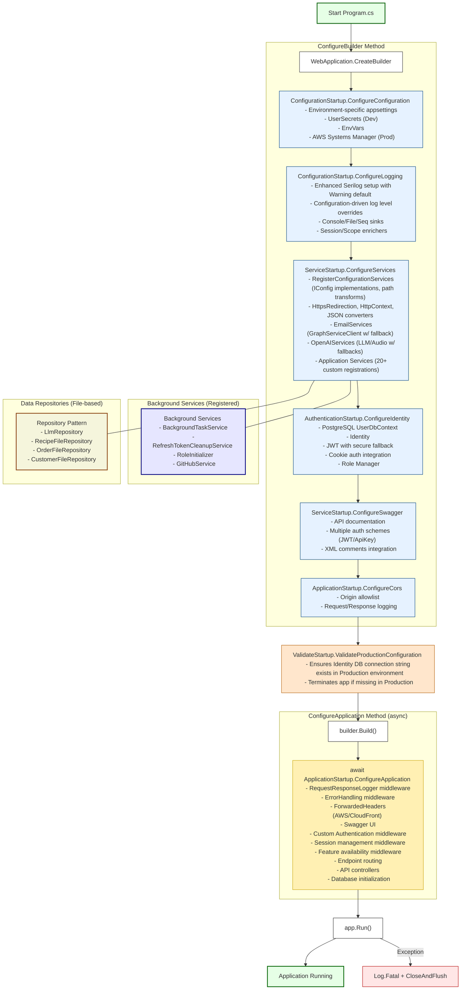

# Module/Directory: /Startup

**Last Updated:** 2025-01-25

> **Parent:** [`Server`](../README.md)

## 1. Purpose & Responsibility

* **What it is:** This module centralizes application startup configuration, service registration, and middleware setup logic, previously scattered across `Program.cs` and various extension files.
* **Key Responsibilities:**
    * Providing a structured, organized approach to application bootstrap and configuration.
    * Centralizing all startup-related configuration methods previously embedded in `Program.cs`.
    * Consolidating service registration extension methods from various modules into a single, coherent location.
    * Handling the configuration of encoding, Kestrel, logging, services, identity, Swagger, and CORS.
    * Defining middleware registration and application pipeline setup.
* **Why it exists:** To improve code organization by separating startup concerns from the main program entry point, reducing complexity in `Program.cs`, and providing a more maintainable structure for configuration-related code.
* **Submodules:**
    * [`App`](./App/) - Core application setup, including Kestrel, CORS, and HTTP request pipeline.
    * [`Authentication`](./Authentication/) - Identity, JWT, and API key authentication configuration.
    * [`Configuration`](./Configuration/) - Configuration loading, binding, and validation.
    * [`Middleware`](./Middleware/) - Custom middleware setup for sessions and request logging.
    * [`Services`](./Services/) - Registration of application services and dependencies.

## 2. Architecture & Key Concepts

* **High-Level Design:** The module is organized into logically grouped static classes:
    * `ApplicationStartup`: Handles core application setup like encoding, Kestrel, CORS, and HTTP request pipeline.
    * `AuthenticationStartup`: Configures Identity, JWT, and API key authentication.
    * `ConfigurationStartup`: Manages configuration loading, binding, and validation.
    * `MiddlewareStartup`: Sets up custom middleware for sessions and request logging.
    * `ServiceStartup`: Registers application services, OpenAI, email services, and configures Swagger.
    * `ValidateStartup`: Handles critical validation checks during application startup.
* **Core Logic Flow:** 
    1. `Program.cs` calls `ConfigureBuilder`, which invokes various startup methods from the specialized classes.
    2. These methods set up different aspects of the application (encoding, Kestrel, configuration sources, logging, services).
    3. After building the application, `ConfigureApplication` is called to set up the middleware pipeline.
* **Key Data Structures:** Primarily operates on ASP.NET Core types like `WebApplicationBuilder`, `WebApplication`, and `IServiceCollection`.
* **State Management:** This module primarily establishes the application's initial state and configuration. It doesn't directly manage runtime state but sets up the services and middleware that will.
* **Service Registration:**
    * Registers `IConfigurationStatusService` and `ConfigurationStatusService` for configuration status reporting, enabling the `/api/status/config` endpoint for health checks.
* **Diagram:**

## 3. Interface Contract & Assumptions

* **Key Public Interfaces (for external callers):**
    * `ApplicationStartup`:
        * `ConfigureEncoding()`: Sets up text encoding for the application.
        * `ConfigureKestrel(WebApplicationBuilder)`: Configures the Kestrel web server.
        * `ConfigureCors(WebApplicationBuilder)`: Sets up CORS policies.
        * `ConfigureApplication(WebApplication)`: Configures the middleware pipeline.
    * `ConfigurationStartup`:
        * `ConfigureConfiguration(WebApplicationBuilder)`: Sets up configuration sources.
        * `ConfigureLogging(WebApplicationBuilder)`: Configures enhanced Serilog logging with Warning default level and configuration-driven overrides. Full configuration details available at [`../../../Docs/Development/LoggingGuide.md`](../../../Docs/Development/LoggingGuide.md).
        * `RegisterConfigurationServices(IServiceCollection, IConfiguration)`: Registers configuration services.
        * `AddPrompts(IServiceCollection, Assembly[])`: Registers prompt types from specified assemblies.
        * `ValidateAndReplaceProperties(object, string)`: Validates config properties and logs warnings for missing required values (no longer throws exceptions).
    * `AuthenticationStartup`:
        * `ConfigureIdentity(WebApplicationBuilder)`: Sets up ASP.NET Core Identity and JWT authentication.
        * `AddIdentityServices(IServiceCollection, IConfiguration)`: Adds Identity and JWT authentication services.
        * `UseCustomAuthentication(IApplicationBuilder)`: Adds API key authentication middleware.
    * `MiddlewareStartup`:
        * `AddRequestResponseLogger(IServiceCollection, Action<RequestResponseLoggerOptions>?)`: Adds request/response logging configuration.
        * `AddSessionManagement(IServiceCollection)`: Adds session management services.
        * `UseSessionManagement(IApplicationBuilder)`: Uses session management middleware.
    * `ServiceStartup`:
        * `ConfigureServices(WebApplicationBuilder)`: Registers core application services.
        * `ConfigureEmailServices(IServiceCollection)`: Sets up email services using Microsoft Graph. Uses a factory that checks IConfigurationStatusService for Email service availability and returns a proxy that throws ServiceUnavailableException if unavailable.
        * `ConfigureOpenAiServices(IServiceCollection)`: Sets up OpenAI services. Uses factories that check IConfigurationStatusService for Llm service availability and return proxies that throw ServiceUnavailableException when their methods are invoked if unavailable.
        * `ConfigureApplicationServices(IServiceCollection)`: Registers domain-specific application services.
        * `ConfigureSwagger(WebApplicationBuilder)`: Configures Swagger/OpenAPI documentation.
    * `ValidateStartup`:
        * `ValidateProductionConfiguration(WebApplicationBuilder)`: Validates critical configuration settings in Production environment and terminates the application if required configurations are missing or invalid.
* **Critical Assumptions:**
    * **Dependency Injection:** Assumes proper DI container setup in `Program.cs` before these methods are called.
    * **Configuration:** Assumes `IConfiguration` has been properly initialized by the time these methods are invoked.
    * **Missing Configuration Handling:** Properties marked with `[Required]` or `[RequiresConfiguration]` will generate warnings at startup if missing but will not prevent application startup. The `IConfigurationStatusService` tracks service availability based on configurations with `[RequiresConfiguration]` attributes. Services register proxies that throw `ServiceUnavailableException` when their methods are invoked if required configuration is unavailable.
    * **Critical Production Validation:** Some critical configuration elements like the Identity database connection string are strictly validated in Production environment through `ValidateStartup.ValidateProductionConfiguration`. The application will fail to start if these critical elements are missing or invalid when running in Production.
    * **AWS Systems Manager Configuration:** The AWS Systems Manager configuration provider is now optional, allowing the application to start successfully even if AWS credentials are not configured or accessible. This adheres to the goal of deferring configuration validation failures to runtime rather than preventing application startup.
    * **Middleware Order:** Assumes the specific order of middleware registration in `ConfigureApplication` is maintained to ensure proper request processing. In particular, the `FeatureAvailabilityMiddleware` must be registered after routing and authentication but before `MapControllers()` to ensure it can access endpoint metadata and correctly validate feature requirements.
    * **Order of Operations:** Methods in `ConfigureBuilder` must be called in the correct order to ensure dependencies are properly established.

## 4. Local Conventions & Constraints (Beyond Global Standards)

* **Method Naming:** Configuration methods follow the "Configure[Feature]" naming pattern.
* **Logical Grouping:** Code is grouped by functional area (App, Authentication, Configuration, Middleware, Services) for improved organization.
* **Extension Methods:** Extension methods related to specific subsystems are defined within their relevant startup classes.
* **Technology Choices:** Relies heavily on ASP.NET Core's builder pattern and extension method approach to configuration.

## 5. How to Work With This Code

* **Adding New Configuration:**
    1. Identify the appropriate startup class based on the functionality (app, auth, config, middleware, services).
    2. Add a new method to the relevant startup class following the existing pattern.
    3. Update `Program.cs` to call this new method at the appropriate point in the configuration sequence.
* **Extending Service Registration:**
    1. Add new extension methods to the appropriate startup class.
    2. Call these methods from the relevant configuration point.
* **Common Pitfalls / Gotchas:**
    * Ensure middleware is registered in the correct order in `ApplicationStartup.ConfigureApplication`.
    * Take care not to create circular dependencies during service registration.
    * Be mindful that some configuration relies on services registered earlier in the process.

## 6. Dependencies

* **Internal Code Dependencies:**
    * [`/Config`](../Config/README.md) - Provides configuration models and the `IConfig` interface.
    * [`/Services/Auth`](../Services/Auth/README.md) - Authentication and authorization components.
    * [`/Services/Sessions`](../Services/Sessions/README.md) - Session management services and middleware.
    * [`/Services/AI`](../Services/AI/README.md) - AI services and `PromptBase` class.
* **External Library Dependencies:**
    * `Microsoft.AspNetCore.*` - Core ASP.NET libraries for web app building.
    * `Microsoft.Extensions.*` - Configuration and DI extensions.
    * `Microsoft.EntityFrameworkCore` - For DbContext configuration.
    * `Microsoft.IdentityModel.*` - JWT token handling.
    * `Serilog` - Structured logging implementation.
* **Dependents (Impact of Changes):**
    * [`Program.cs`](../../Program.cs) - Directly depends on methods from this module.
    * All modules registered during startup indirectly depend on this module working correctly.

## 7. Rationale & Key Historical Context

* **Refactoring Motivation:** This module was created to improve the organization and maintainability of the application's startup code by centralizing configuration and service registration logic that was previously scattered across `Program.cs` and various extension files.
* **Logical Grouping:** The decision to organize code by functional area (App, Authentication, Configuration, Middleware, Services, Validation) provides a clearer separation of concerns and makes it easier to locate specific functionality.
* **Middleware Ordering:** The specific order of middleware registration in `ApplicationStartup.ConfigureApplication` has been carefully preserved to ensure proper request processing, with critical middleware like error handling and authentication positioned appropriately. The `FeatureAvailabilityMiddleware` is positioned after authentication but before endpoint execution to ensure it can access endpoint metadata and validate feature requirements before controllers are invoked.
* **Configuration Validation Change:** The configuration validation process was modified to log warnings instead of throwing exceptions for missing required configuration values. This change allows the application to start even with incomplete configuration, deferring validation failures to runtime when specific features attempt to use the missing configuration. This approach enables partial functionality of the application even when some external service configurations (like API keys) are missing.
* **Service Unavailability Strategy:** Instead of returning null from service factories, we now register proxy implementations of external clients (GraphServiceClient, OpenAIClient, AudioClient) that throw ServiceUnavailableException when their methods are invoked if required configuration is missing. This provides clearer error messages and more consistent behavior when a service can't operate due to missing configuration. This is now complemented by the `FeatureAvailabilityMiddleware` which proactively checks if an endpoint can be served based on its declared feature dependencies before the endpoint is invoked, providing a more immediate response to API consumers.
* **RequiresConfiguration Attribute:** Configuration properties that are critical for services to function are now marked with the RequiresConfiguration attribute. The IConfigurationStatusService tracks these properties and reports service availability status based on their values, which is used by service factories to determine whether to register real implementations or proxies.
* **AWS Systems Manager Configuration:** The AWS Systems Manager configuration provider was made optional to align with the overall configuration validation strategy. This prevents the application from failing to start when AWS credentials are not configured or the AWS service is unavailable, allowing for local development without AWS setup and ensuring that only the specific features requiring AWS configuration will fail at runtime rather than blocking the entire application startup.

## 8. Known Issues & TODOs

* Consider further breaking down large configuration methods like `ServiceStartup.ConfigureApplicationServices` into more focused methods for better maintainability.
* Evaluate the possibility of making certain configuration behavior more customizable through appsettings.json rather than being hardcoded.